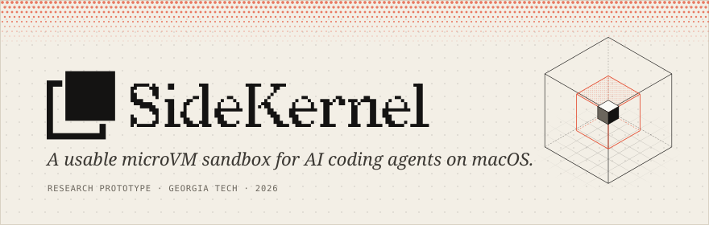

<picture>
  <source media="(prefers-color-scheme: light)" srcset="assets/banner-light.svg">
  
</picture>

<p align="center">
  <a href="https://sidekernel.com/sidekernel.pdf"><b>Report</b></a> &nbsp;·&nbsp;
  <a href="https://sidekernel.com"><b>Site</b></a> &nbsp;·&nbsp;
  <a href="https://sidekernel.com/essay/"><b>Note from the developer</b></a>
</p>


SideKernel is a usable sandbox for AI coding agents (e.g. Claude Code). "Usable" means it tries to stay out of your way and to feel as if it's not there. It is developed as a capstone project for Georgia Tech's MSc in Cybersecurity.

Beyond AI agents, SideKernel is useful for trying out software without installing it on your host (e.g. untrusted npm packages).

> [!TIP]
> **Why does SideKernel exist?** Read the note from the developer: [*AI Coding Agents: Between Two Uncomfortable Choices*](https://sidekernel.com/essay/). 

> [!NOTE]
> SideKernel is still in research preview and not yet ready for production use. Use it responsibly. Please read the <a href="https://sidekernel.com/sidekernel.pdf"><b>Report</b></a> or the <a href="https://sidekernel.com"><b>sidekernel.com</b></a> to learn more.

## Install

Tested on M1 and M4 (macOS 26.2); other Apple silicon chips should work.

Install with `brew` (recommended)

```sh
brew tap minoansecurity/sidekernel https://github.com/minoansecurity/sidekernel && brew trust --formula minoansecurity/sidekernel/sidekernel
brew install sidekernel
```

Install directly from source:

```sh
rustup target add aarch64-unknown-linux-musl
git clone https://github.com/minoansecurity/sidekernel
cd sidekernel
make install
```

The first run builds the root filesystem so it might take a minute or two. 

## Usage

**On the host** (from a project folder):

```bash
sk          # launch an ephemeral microVM, current directory mounted
sidekernel  # (alias: sk)
sclaude     # launch a sandbox and start Claude Code directly
```

Coming soon: `scodex`, `sgemini`, `sgrok`, and more.

**Inside the sandbox:**

```bash
sk-drop <host-path>   # copy a host file into the sandbox (requires approval on the host)
sk-net on/off         # block all outbound traffic
save                  # persist installed packages across sandboxes
fightsong             # Print's Georgia Tech's fight song on the terminal 🐝 (alias: ramblinwreck)
```

You can also **drag and drop** files directly into Claude Code.

## Limitations and Notes on Security

There is no such thing as perfect security, and SideKernel is almost certainly not an inescapable fortress. Sandbox escapes exist, even in microVM sandboxes, most commonly through implementation bugs and sometimes through kernel or hypervisor vulnerabilities. This is a research prototype, not a mature product. It hasn't been battle-tested over time, extensively security tested, externally audited or formally verified, and it hasn't yet reached a stable v1.0.0.

A few things worth knowing:

- **I've tried to keep it as lean as possible.** I've minimized the TCB and periodically review the code for security issues myself.
- **Usability has a cost.** Every feature that makes the sandbox feel native (file sharing, clipboard, port forwarding, bringing host tools along) means more code, which means more attack surface.
- **Escapes have been found, and more likely exist.** I found and fixed several bugs and vulnerabilities before release, and there's no reason to assume none remain. Sandboxes from large companies have had severe vulnerabilities too (e.g. CVE-2026-77179).

Most of this isn't unique to SideKernel; I'd just rather be upfront about it. Using a sandbox is very likely better than not using one, and letting agents work freely inside it is exactly what it's for. Just don't let it lull you into a false sense of security. Keep what you expose to it (shared folders, credentials, network access) limited to what the task needs, and keep in mind that any security control can fail: cybersecurity is ultimately risk management, not risk elimination.

**In short:**

- **Do I personally run my coding agents in SideKernel?** Yes.
- **Should you run your coding agents in SideKernel?** It's up to you.
- **Do I let my agents loose in SideKernel?** Very often.
- **Should you let your agents loose in SideKernel?** It's up to you.
- **Do I think SideKernel is reasonably secure?** Yes.
- **Can I guarantee that SideKernel is secure?** No.

For more on the threat model and limitations, see the [practicum report](https://sidekernel.com/sidekernel.pdf), the [website](https://sidekernel.com/) and, of course, the code itself.

Found a vulnerability? Please [report it privately on GitHub](https://github.com/minoansecurity/sidekernel/security/advisories/new). Reports are welcome and taken seriously, but fixes may take a little while. The project is still small and it's just me at the moment. Contributions are welcome.

## Learn more

- [Note from the developer](https://sidekernel.com/essay/): the motivation and the honest trade-offs
- [Practicum Report](https://sidekernel.com/sidekernel.pdf): the capstone final report with design and evaluation details
- [Website](https://sidekernel.com/)


## License

SideKernel is open-source software, licensed under the [Apache License, Version 2.0](LICENSE).
